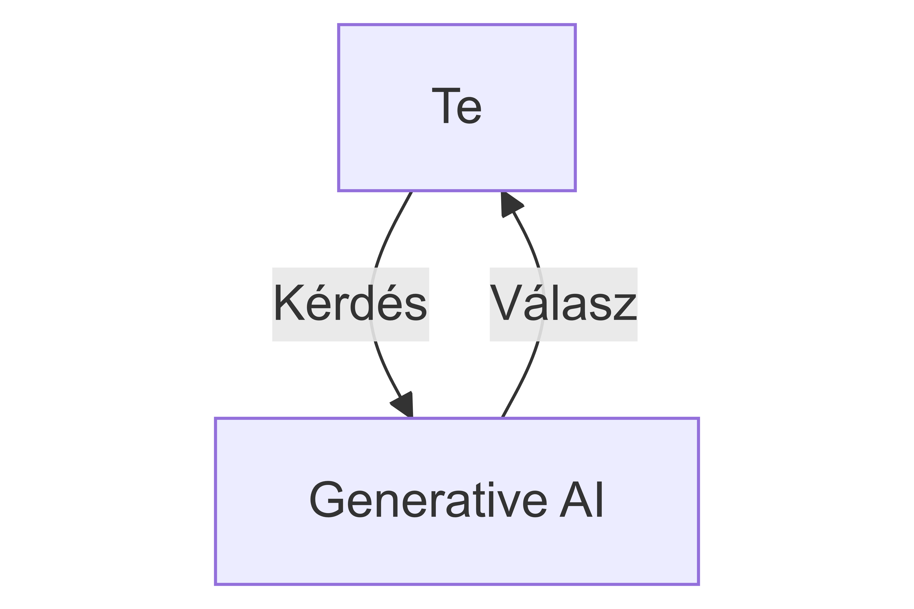
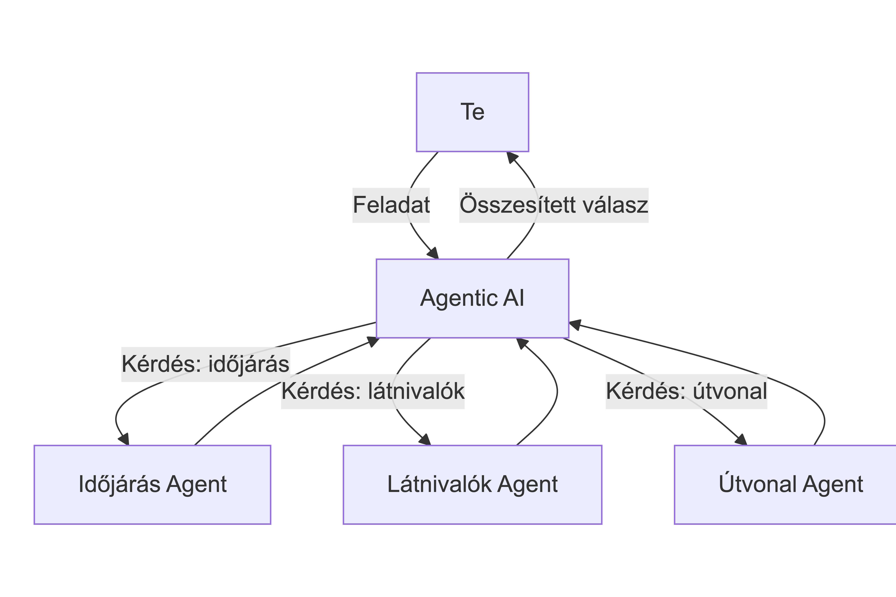
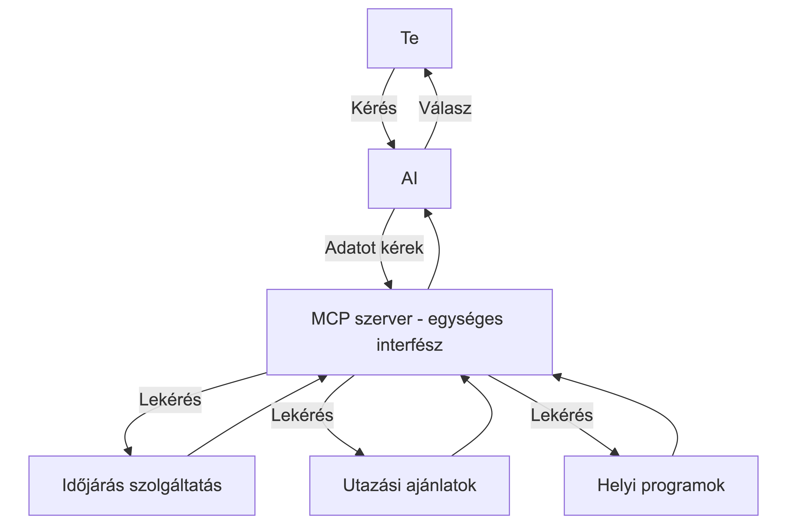

# Mentor Klub képzési anyag: Azure OpenAI és ChatGPT

_(Új generációs AI megoldások)_

Képzés elérhető: https://gerillamentorklub.hu

Szeretnéd megtudni, hogyan hozhatod ki a legtöbbet a ChatGPT-ből, ha vállalati környezetben, biztonságosan és skálázhatóan használod?  
Ez a kurzus abban segít, hogy gyakorlati példákon keresztül megismerd, hogyan használhatod az Azure-ban elérhető OpenAI és ChatGPT eszközöket.

1,5 óra alatt áttekintjük: a legfontosabb trendeket, kipróbáljuk az Azure AI Foundry Studio szolgáltatásait, valódi alkalmazásokat mutatunk be: ügyfélszolgálati chatbot, tartalomgenerálás, RAG dokumentumokkal, képi és videós AI.

A képzés végére nemcsak a technológiát érted meg, hanem kézzelfogható ötletekkel és példákkal távozol, amelyeket azonnal hasznosíthatsz a munkádban – mindezt biztonságosan és skálázhatóan.

A kurzus nemcsak a technikai készségeidet fejleszti, hanem karrierépítési szempontból is előnyt jelent, mivel az AI-alapú megoldások iránti kereslet folyamatosan növekszik.

---

## Kinek szól?

- **Kezdőknek**, akik szeretnék megismerni az AI technológiák alapjait az Azure platformon.
- **Bárkinek**, aki szeretné megérteni és kipróbálni a legfrissebb AI lehetőségeket az Azure ökoszisztémában.
- **Fejlesztőknek és IT szakembereknek**, akik karrierjüket az AI területén kívánják építeni.
- **Üzleti szakembereknek**, akik eszközeként kívánják alkalmazni az AI megoldásokat.

---

## Tematika

- **Miért fontos az AI 2025-ben?**
- **Azure és OpenAI kapcsolata**
- **Azure AI Foundry Studio bemutatása**
- **Modellek, kvóták, eszközök**
- **Biztonsági, praktikus tanácsok**
- **Gyakorlati példák és demók**

## Miért fontos az AI 2025-ben?

A képzési anyagból itt csak a Generative AI, Agentic AI és az MCP (Model Context Protocol) ábráit tesszük közzé, a teljes anyag a képzésen elérhető.

### Generative AI

Generative AI esetén a modell egy adott bemeneti adat (prompt) alapján új, eredeti tartalmat hoz létre, legyen az szöveg, kép, zene vagy akár videó. A generatív modellek képesek kreatív feladatok elvégzésére, például történetek írására, képek festésére vagy zenék komponálására.



### Agentic AI

Agentic AI olyan mesterséges intelligencia rendszerekre utal, amelyek képesek önállóan cselekedni és döntéseket hozni egy adott környezetben. Ezek az AI rendszerek nemcsak reagálnak a bemeneti adatokra, hanem képesek célokat kitűzni, tervezni és végrehajtani feladatokat anélkül, hogy folyamatos emberi beavatkozásra lenne szükségük.



### MCP

Model Context Protocol (MCP) egy olyan szabvány vagy protokoll, amely lehetővé teszi a különböző AI modellek és rendszerek közötti interoperabilitást és együttműködést. Az MCP célja, hogy egységes keretet biztosítson az AI modellek közötti kommunikációhoz, adatcseréhez és integrációhoz, megkönnyítve ezzel a komplex AI alkalmazások fejlesztését és üzemeltetését. Legnagyobb előnye, hogy szabványosított interfészt biztosít, így a különböző gyártók és fejlesztők által készített modellek könnyebben integrálhatók és használhatók együtt.



## Gyakorlati példák

### Ügyfélszolgálati chatbot

Több modellel is kipróbálhatjuk, hogyan lehet egy ügyfélszolgálati chatbotot létrehozni, amely képes természetes nyelven kommunikálni a felhasználókkal, megérteni kérdéseiket és releváns válaszokat adni. A kimenetet nem csak a modell, hanem a "system prompt" is befolyásolja, amely meghatározza a chatbot viselkedését és stílusát.

Itt mi az alábbi "system prompt"-ot használtuk:

```
Te egy segítőkész ügyfélszolgálati asszisztens vagy, aki rövid, barátságos válaszokat ad a felhasználóknak.
```

Utána kipróbálhatod az alábbi kérdéseket feltenni a modellnek:

- Elfelejtettem a jelszavamat, hogyan tudok újat kérni?
- Hogyan kell elkészíteni a negyedéves pénzügyi jelentést?
- Hogyan kezeljem a problémás ügyfeleket?
- Van üzemanyag kártya a céges autóhoz?

### Webalkalmazás létrehozása chatbothoz

Az előző példában bemutatott chatbotot egy webalkalmazásban lehet publikálni, hogy a felhasználók könnyen elérhessék. Az alkalmazás egy egyszerű felhasználói felületet biztosít, ahol a felhasználók beírhatják kérdéseiket, és a chatbot válaszol rájuk.

Ennek egy részletezését itt találod: [Webalkalmazás létrehozása Chatbothoz Azure-ban](https://github.com/cloudsteak/trn-azure-ai/blob/main/README.md#5-webalkalmaz%C3%A1s-l%C3%A9trehoz%C3%A1sa-chatbothoz-azure-ban)

A felhasználóknak a hozzáférést az alábbi módon lehet biztosítani: [Felhasználói azonosítás beállítása](https://github.com/cloudsteak/trn-azure-ai/blob/main/README.md#6-felhaszn%C3%A1l%C3%B3i-azonos%C3%ADt%C3%A1s-be%C3%A1ll%C3%ADt%C3%A1sa)

### RAG (Retrieval-Augmented Generation) dokumentumokkal

A RAG egy olyan technika, amely ötvözi a keresési és generatív modelleket, hogy pontosabb és relevánsabb válaszokat adjon a felhasználói kérdésekre. A RAG rendszer először egy keresési modellt használ, hogy megtalálja a legrelevánsabb dokumentumokat egy adott kérdés alapján, majd egy generatív modellt alkalmaz, hogy ezekből a dokumentumokból összefüggő és koherens választ generáljon.

Az alábbi lépéseket követve létrehozhatsz egy RAG alapú alkalmazást:

- [Azure tárfiók létrehozása](https://github.com/cloudsteak/trn-azure-ai/blob/main/README.md#2-azure-t%C3%A1rfi%C3%B3k-l%C3%A9trehoz%C3%A1sa)
- [Azure AI keresőszolgáltatás létrehozása](https://github.com/cloudsteak/trn-azure-ai/blob/main/README.md#3-azure-ai-keres%C5%91szolg%C3%A1ltat%C3%A1s-l%C3%A9trehoz%C3%A1sa)
- [Saját adatforrás használata Chatbothoz Azure AI Foundry Studio-ban](https://github.com/cloudsteak/trn-azure-ai/blob/main/README.md#4-saj%C3%A1t-adatforr%C3%A1s-haszn%C3%A1lata-chatbothoz-azure-openai-studio-ban)

### Segéd (Agent) működésének bemutatása

Nem mi mondjuk meg minden lépésben, hogy mit tegyen a modell, hanem ő maga dönti el, mikor keres dokumentumot, mikor hív egy API-t. Ez a jövő, ahol az AI valóban önálló segítőként működik.

Ebben a példában nem fogunk segédeket írni, csupán az AI Foundry Studio-ban bemutatjuk, hogyan működik ez a gyakorlatban. Ezt a beépített segédekkel lehet kipróbálni, például a `get_weather` segéddel, amely egy időjárás segédet szimulál és a `get_stock_price` segéddel, amely egy részvényár segédet szimulál.

Tehát valódi időjárás és részvényár adatokat nem fogunk lekérdezni, de a modell viselkedését megfigyelhetjük.

Ehhez egy-egy test adat:

- `get_weather` segédhez:

```
{
  "temperature": 15,
  "condition": "napos",
  "humidity": 60
}
```

- `get_stock_price` segédhez:

```
{
  "AAPL": 150.25,
  "MSFT": 280.50,
  "GOOGL": 2700.75
}
```

### Videó és kép generálása

Ebben a bemutatóban két részét is kipróbáljuk a generatív AI-nak: képgenerálást és videógenerálást. Ez hasznos lehet például marketing anyagok, vizuális tartalmak készítéséhez.

A képgenerálás során egy szöveges leírás (prompt) alapján a modell új képet hoz létre, például:

```
Egy modern iroda, ahol emberek éppen egy felhőről szóló képzést néznek a kivetítőn. Az oktató vidáman magyaráz. A résztvevők arra gondolnak, hogy ez milyen érdekes téma.
```

A videógenerálás hasonló elven működik, de itt a modell egy rövid animációt vagy videóklipet készít a megadott leírás alapján.  
Például:

```
Egy robot sétál végig a tengerparton, miközben madarak repülnek az égen. A robot megáll egy pillanatra, a tenger felé néz, majd folytatja az útját.
```

### Python alapú chat alkalmazás (API hívással)

Egy egyszerű Python alkalmazást hozunk létre, amely lehetővé teszi a felhasználók számára, hogy természetes nyelven kommunikáljanak egy chatbot-tal. Az alkalmazás az Azure OpenAI szolgáltatást használja a válaszok generálására.

A megoldsát itt találod: [Python alapú chat alkalmazás](./app/)

#### Hogyan használd?

1. Klónozd a repót
2. Lépj be az `app` könyvtárba
3. Hozz létre egy virtuális környezetet és aktiváld

   ```bash
   # Makefile
   make venv-mac # MacOS
   make venv-linux # Linux
   make venv-win # Windows
   ```

4. Aktiváld a virtuális környezetet

   ```bash
   # Makefile
   make activate-mac # MacOS
   make activate-linux # Linux
   make activate-win # Windows
   ```

5. Telepítsd a szükséges csomagokat
   ```bash
   # Makefile
   make install
   ```
6. A környezeti változók beállítása:

   ```bash
   # Makefile
   make env
   ```

   A `.env` fájlban állítsd be a következő változókat:

   - AZURE_OPENAI_ENDPOINT: Az Azure OpenAI szolgáltatásod végpontja (pl. https://<ai foundry erőforrás neve>.openai.azure.com/)
   - AZURE_OPENAI_API_KEY: Az Azure OpenAI szolgáltatásod API kulcsa
   - AZURE_OPENAI_DEPLOYMENT: Az Azure OpenAI szolgáltatásod üzemelő példányának neve (pl. gpt-4o)
   - AZURE_OPENAI_API_VERSION: Az Azure OpenAI szolgáltatásod API verziója (pl. 2024-12-01-preview)

7. Futtasd az alkalmazást

   ```bash
    # Makefile
    make run
   ```

8. A parancssorban írd a mkérdésedet a `Te:` után, majd nyomj Enter-t. A chatbot válaszolni fog a kérdésedre.
